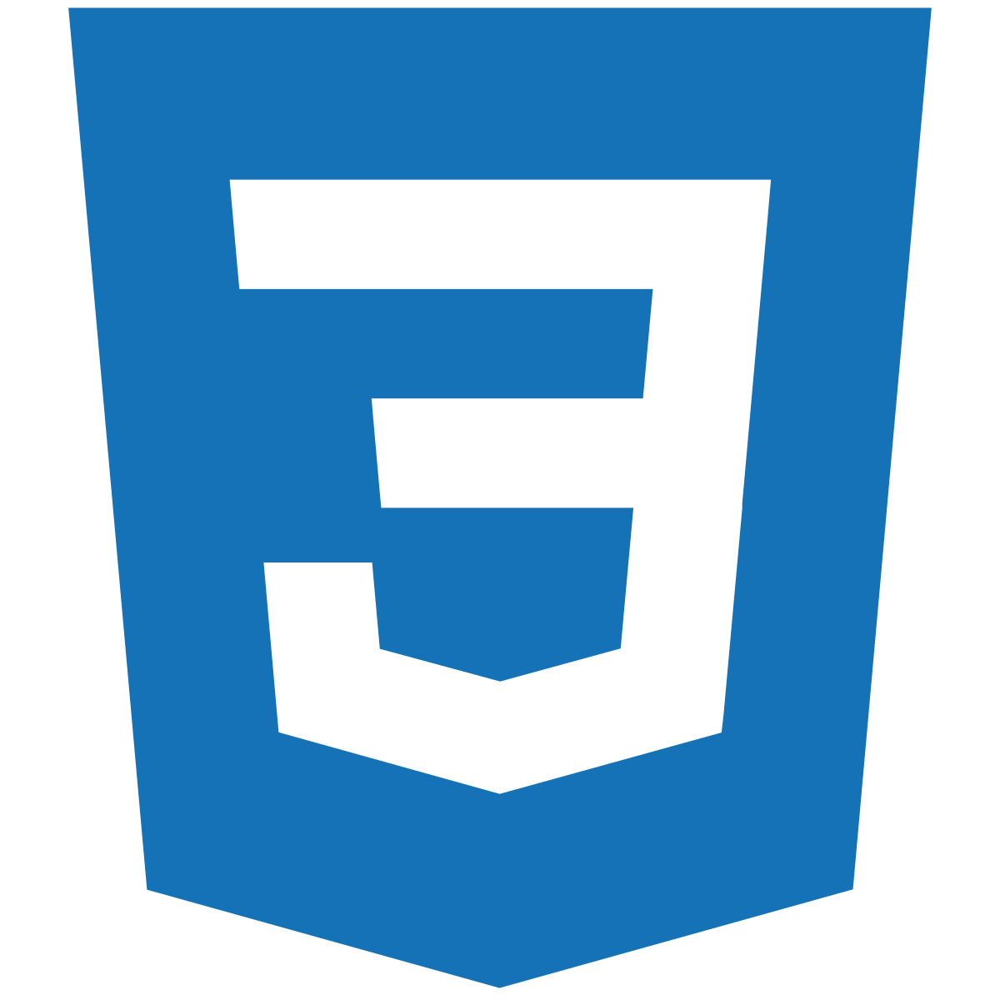

  

<!-- 
### Hello there! 👋 -->

<h2 align="center">I'm Leonardo, glad you're here!! 😄 I'm a Full Stack Developer proudly graduated at @Henry 🚀😎, I like challenges that's why turned on my career at that direction, you see, I used to be a restaurant captain who aspired to be a manager, but technology always been there, so... it's never too late to choose the directon of your career isn't it?.... This is the way</h2>

&nbsp;&nbsp;

## 🛠️ Languages:

    <!-- <code></code> -->
    <code></code>
    <code></code>
    <code></code>
    <code></code>
    <code></code>
     
    <code></code>
    <code></code>
    <code></code>
    <code></code>
    <code></code>

&nbsp;

## 📫 Contact me!

<a href="https://www.linkedin.com/in/leogarcia-dev/" > &nbsp;
<a href="mailto:leogogcia@gmail.com" >

<!--
**leogcia/leogcia** is a ✨ _special_ ✨ repository because its `README.md` (this file) appears on your GitHub profile.

Here are some ideas to get you started:

- 🔭 I’m currently working on ...
- 🌱 I’m currently learning ...
- 👯 I’m looking to collaborate on ...
- 🤔 I’m looking for help with ...
- 💬 Ask me about ...
- 📫 How to reach me: ...
- 😄 Pronouns: ...
- ⚡ Fun fact: ...
-->
